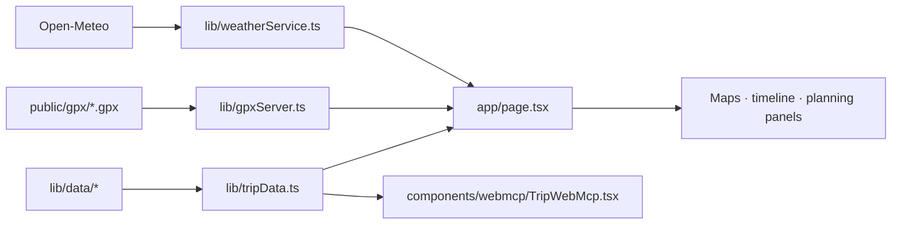

# Austria Expedition 2026

Austria Expedition 2026 is a public-safe Next.js itinerary for a ten-day route
through Vienna, the Salzkammergut, Tyrol, and Innsbruck. It turns a structured
trip plan into an interactive route overview, daily timeline, phase maps,
GPX-backed hikes, weather outlook, packing plan, bookings context, and
pre-departure checks.

Open the deployed itinerary at
[vienna-travel.vercel.app](https://vienna-travel.vercel.app).

## Run locally

Requires Node.js and pnpm.

```bash
pnpm install
pnpm dev
```

Open [http://localhost:3000](http://localhost:3000).

```bash
pnpm lint
pnpm build
```

Near-term weather, OpenStreetMap/Overpass rail geometry, and OSRM route data
are live network inputs. If a forecast is out of range or unavailable, the UI
keeps the static seasonal guidance from the itinerary data. `NEXT_PUBLIC_CARTO_BASEMAP_KEY`
is optional; without it the map uses its configured fallback tiles.

## Privacy

Keep traveler names, contacts, booking references, ticket or loyalty numbers, payment data, and private provider links out of this repository. See [`SECURITY.md`](SECURITY.md) before changing trip fixtures.

## What is included

- Four itinerary phases: Vienna, Salzkammergut, Tyrol, and the Olpererhütte /
  return leg.
- Day cards with activities, highlights, accommodation, travel segments,
  carry recommendations, deadlines, and live checks.
- Leaflet maps for the overall route, drives, city walks, POIs, and hikes.
- Local GPX files for Seebensee–Drachensee and the three-lakes loop, parsed on
  the server into distance, elevation gain, and profile data.
- Forecast weather from Open-Meteo when the date is within range, with
  historical guidance and explicit alpine-window context otherwise.
- Read-only WebMCP tools exposing the same redacted trip overview, day plans,
  weather, and plan-search data rendered by the page.

## Rendering and source map



- `lib/data/` is the canonical fixture layer. `trip.ts`, `phases.ts`,
  `itinerary.ts`, `transport.ts`, `stays.ts`, `hikes.ts`, `pois.ts`,
  `packing.ts`, and `logistics.ts` own the redacted trip facts.
- `app/page.tsx` performs server-side route, GPX, and weather enrichment before
  rendering the page.
- `components/map/`, `timeline/`, `weather/`, `planning/`, and `phases/` own
  the user-facing surfaces.
- `scripts/check-public-data.mjs` is the privacy gate used by CI.

For the full data conventions and architecture decisions, read
[`spec.md`](spec.md) and [`lib/data/README.md`](lib/data/README.md).

## Status and data boundary

This repository contains a redacted planning demo, not a booking system or a
source of live travel guarantees. Keep confirmations and traveler-specific
records in a private system; the checked-in itinerary intentionally omits
identifying and account-specific values. The current trip fixtures describe the
September 5–14, 2026 plan and should be treated as editable planning data.
