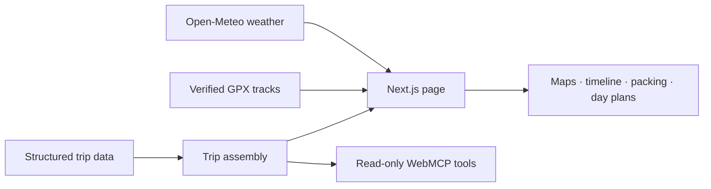

<div align="center">

# 🏔️ Austria Expedition

### Coffee in Vienna. Lakes in Salzkammergut. Boots on in the Alps.

**Ten days of Austria, with the whole adventure at your fingertips.**

[](https://vienna-travel.vercel.app)
[](package.json)
[](components/map/)
[](https://github.com/aranlucas/vienna-travel/actions/workflows/ci.yml)

[](https://vienna-travel.vercel.app)

<sub>Destination-inspired cover illustration. Open the demo to explore the actual itinerary.</sub>

**[Explore the trip ↗](https://vienna-travel.vercel.app) · [See the day-by-day timeline ↗](https://vienna-travel.vercel.app/timeline) · [Make it your own](#make-it-your-own)**

</div>

## A trip worth getting excited about

Start among Vienna’s grand streets, wind through lake country, and trade city shoes for hiking boots beneath the Tyrolean peaks. **Austria Expedition** turns a ten-day trip into a browsable travel companion: follow the route, open a day’s plan, scout a hike, and see what belongs in your bag.

It is built for the moment you ask, **“What’s the plan today—and what do we need before we leave?”** The map, timeline, weather outlook, stays, and practical checks live together, so the next leg of the adventure is easy to find.

## Four chapters. One very good excuse to go outside.

| Chapter                     | The mood                                             | Explore in the app                                                                       |
| --------------------------- | ---------------------------------------------------- | ---------------------------------------------------------------------------------------- |
| 🏛️ **Vienna**               | Imperial streets and a proper coffee break.          | City walking routes, landmarks, and day-by-day stops.                                    |
| 🩵 **Salzkammergut**        | Lakeside villages and water that barely looks real.  | A regional map, suggested stops, and the next drive.                                     |
| 🥾 **Tyrolean Alps**        | Big peaks, alpine lakes, and a well-earned hut stop. | Seebensee–Drachensee hike details, the optional three-lake loop, and elevation profiles. |
| 🌲 **Achensee & Innsbruck** | One more lake. One more mountain view.               | The final days around Pertisau and Innsbruck, plus the journey home.                     |

## The little details that make a big trip easier

- **🗺️ Get the whole picture.** Interactive Leaflet maps connect the overall route with city walks, drives, points of interest, and hiking details.
- **📅 Go from “sometime that day” to an actual plan.** Daily cards and the travel timeline bring activities, transport, and accommodation into the same view.
- **🥾 Know the climb before the climb.** Hike cards show distance, elevation, difficulty, highlights, and GPX downloads. The verified three-lake track powers its route data; the Seebensee file is clearly marked as a separate valley-start reference.
- **🌦️ Pack for the day ahead.** Weather outlooks, seasonal guidance, and packing recommendations put the practical decisions close to the itinerary.
- **✅ Keep the logistics in sight.** Booking status, departure checks, and planning reminders sit alongside the fun parts.
- **🤖 Let an assistant read the plan.** Read-only WebMCP tools expose the same trip overview, day plans, weather, and searchable itinerary data shown in the interface.

**Take a quick tour:** open the [trip](https://vienna-travel.vercel.app), choose a region, look through a day’s activities, and open its map. Then jump to the [timeline](https://vienna-travel.vercel.app/timeline) or [packing plan](https://vienna-travel.vercel.app/packing) to see how the pieces fit together.

## Make it your own

The checked-in itinerary covers **September 5–14, 2026**. It is a concrete example you can explore or adapt by editing structured trip data.

### Run it locally

Use **Node.js 24** (matching CI) and **pnpm 12.4.2** (pinned in `package.json`).

```bash
git clone https://github.com/aranlucas/vienna-travel.git
cd vienna-travel
pnpm install --frozen-lockfile
npm install -g portless@0.15.7
pnpm dev
```

Open [vienna-travel.localhost](https://vienna-travel.localhost).

The default maps work without `NEXT_PUBLIC_CARTO_BASEMAP_KEY`; set it to use the optional CARTO basemap. Weather and route enrichment use external services. When a forecast is unavailable or outside its date range, the interface retains seasonal itinerary guidance.

### Change the journey

Start in [`lib/data/`](lib/data/README.md):

| Want to change…                    | Edit…                           |
| ---------------------------------- | ------------------------------- |
| The trip title and dates           | `trip.ts`                       |
| The daily adventure                | `itinerary.ts`                  |
| Regions and map views              | `phases.ts`                     |
| Where to stay and how to get there | `stays.ts` and `transport.ts`   |
| Hikes and places worth a detour    | `hikes.ts` and `pois.ts`        |
| What to pack and what to check     | `packing.ts` and `logistics.ts` |

Trip data flows through `lib/tripData.ts`; timeline events are derived from those records. Keep dates, activities, and bookings in their source files so the views stay in sync.

<details>
<summary><strong>Under the hood: maps, weather, and one shared trip model</strong></summary>



- `app/page.tsx` enriches the trip with route, GPX, and weather data on the server.
- `components/map/`, `timeline/`, `weather/`, `planning/`, and `phases/` provide the main views.
- `lib/gpxServer.ts`, `weatherService.ts`, and `routingService.ts` handle external and geographic data.
- `components/webmcp/TripWebMcp.tsx` exposes the trip to compatible browser agents.

See [`spec.md`](spec.md) and the [data guide](lib/data/README.md) for the full architecture.

</details>

### Check your changes

```bash
pnpm check:privacy
pnpm lint
pnpm typecheck
pnpm build
```

This is a public itinerary demo. Keep personal traveler details and private booking references out of trip fixtures; [`SECURITY.md`](SECURITY.md) explains the boundary. Confirm current conditions and reservations with their providers when adapting the plan.

---

**Ready for the scenic route? [Explore Austria Expedition →](https://vienna-travel.vercel.app)**

### Named local URL with Portless

After the normal project setup, use [Portless](https://github.com/vercel-labs/portless/tree/v0.15.7)
to run this app alongside other repositories without choosing a port. Use Node.js
24 or newer, within this project's supported Node version, and install the CLI once:

```sh
npm install -g portless@0.15.7
pnpm dev
```

With default proxy settings, the primary checkout is available at
[https://vienna-travel.localhost](https://vienna-travel.localhost). Portless starts
Next.js on an available `PORT`. Linked Git worktrees get a branch
prefix; use the exact URL printed at startup. The proxy reuses its most recent
settings, so a custom port or domain can change that URL.

Run the first launch in an interactive terminal: the default HTTPS setup may ask
to trust a local certificate authority and request administrator access for port
443 and local hostname entries. Use `portless list` to see routes and
`portless doctor` for connection or certificate problems.
